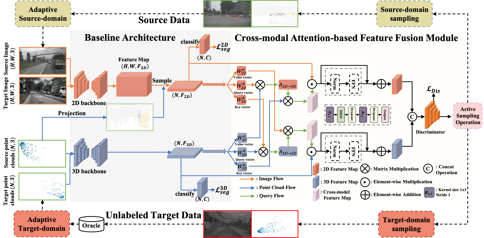

# ADAS: A Simple Active-and-Adaptive Baseline for Cross-Domain 3D Semantic Segmentation

Code for the paper.

<!-- ## Paper -->


<!-- # ADAS: A Simple Active-and-Adaptive Baseline for Cross-Domain 3D Semantic Segmentation -->

State-of-the-art 3D semantic segmentation models are trained on the off-the-shelf public benchmarks, but they often face the major challenge when these well-trained models are deployed to a new domain. In this paper, we propose an Active-and-Adaptive Segmentation (ADAS) baseline to enhance the weak cross-domain generalization ability of a well-trained 3D segmentation model, and bridge the point distribution gap between domains. Specifically, before the cross-domain adaptation stage begins, ADAS performs an active sampling operation to select a maximally-informative subset from both source and target domains for effective adaptation, reducing the adaptation difficulty under 3D scenarios. Benefiting from the rise of multi-modal 2D-3D datasets, ADAS utilizes a cross-modal attention-based feature fusion module that can extract a representative pair of image features and point features to achieve a bi-directional image-point feature interaction for better safe adaptation. Experimentally, ADAS is verified to be effective in many cross-domain settings including: 1) Unsupervised Domain Adaptation (UDA), which means that all samples from target domain are unlabeled; 2) Unsupervised Few-shot Domain Adaptation (UFDA) which means that only a few unlabeled samples are available in the unlabeled target domain; 3) Active Domain Adaptation (ADA) which means that the selected target samples by ADAS are manually annotated. Their results demonstrate that ADAS achieves a significant accuracy gain by easily coupling ADAS with self-training methods or off-the-shelf UDA works.

## Preparation
### Prerequisites
Tested with
* PyTorch 1.4
* CUDA 10.0
* Python 3.8
* [SparseConvNet](https://github.com/facebookresearch/SparseConvNet)
* [nuscenes-devkit](https://github.com/nutonomy/nuscenes-devkit)

### Installation
As 3D network we use SparseConvNet. It requires to use CUDA 10.0 (it did not work with 10.1 when we tried).
We advise to create a new conda environment for installation. PyTorch and CUDA can be installed, and SparseConvNet
installed/compiled as follows:
```
$ conda install pytorch torchvision cudatoolkit=10.0 -c pytorch
$ pip install --upgrade git+https://github.com/facebookresearch/SparseConvNet.git
```

Clone this repository and install it with pip. It will automatically install the nuscenes-devkit as a dependency.
```
$ git clone git@github.com:Fayeben/ADAS.git
$ cd xmuda
$ pip install -ve .
```
The `-e` option means that you can edit the code on the fly.

### Datasets
#### NuScenes
Please download the Full dataset (v1.0) from the [NuScenes website](https://www.nuscenes.org) and extract it.

You need to perform preprocessing to generate the data for xMUDA first.
The preprocessing subsamples the 360° LiDAR point cloud to only keep the points that project into
the front camera image. It also generates the point-wise segmentation labels using
the 3D objects by checking which points lie inside the 3D boxes. 
All information will be stored in a pickle file (except the images which will be 
read frame by frame by the dataloader during training).

Please edit the script `xmuda/data/nuscenes/preprocess.py` as follows and then run it.
* `root_dir` should point to the root directory of the NuScenes dataset
* `out_dir` should point to the desired output directory to store the pickle files

#### A2D2
Please download the Semantic Segmentation dataset and Sensor Configuration from the
[Audi website](https://www.a2d2.audi/a2d2/en/download.html) or directly use `wget` and
the following links, then extract.
```
$ wget https://aev-autonomous-driving-dataset.s3.eu-central-1.amazonaws.com/camera_lidar_semantic.tar
$ wget https://aev-autonomous-driving-dataset.s3.eu-central-1.amazonaws.com/cams_lidars.json
```

The dataset directory should have this basic structure:
```
a2d2                                   % A2D2 dataset root
 ├── 20180807_145028
 ├── 20180810_142822
 ├── ...
 ├── cams_lidars.json
 └── class_list.json
```
For preprocessing, we undistort the images and store them separately as .png files.
Similar to NuScenes preprocessing, we save all points that project into the front camera image as well
as the segmentation labels to a pickle file.

Please edit the script `xmuda/data/a2d2/preprocess.py` as follows and then run it.
* `root_dir` should point to the root directory of the A2D2 dataset
* `out_dir` should point to the desired output directory to store the undistorted images and pickle files.
It should be set differently than the `root_dir` to prevent overwriting of images.

#### SemanticKITTI
Please download the files from the [SemanticKITTI website](http://semantic-kitti.org/dataset.html) and
additionally the [color data](http://www.cvlibs.net/download.php?file=data_odometry_color.zip)
from the [Kitti Odometry website](http://www.cvlibs.net/datasets/kitti/eval_odometry.php). Extract
everything into the same folder.

Similar to NuScenes preprocessing, we save all points that project into the front camera image as well
as the segmentation labels to a pickle file.

Please edit the script `xmuda/data/semantic_kitti/preprocess.py` as follows and then run it.
* `root_dir` should point to the root directory of the SemanticKITTI dataset
* `out_dir` should point to the desired output directory to store the pickle files

## Model Zoo

You can download the models before ADAS from
[this Google drive folder](https://drive.google.com/drive/folders/16MTKz4LOIwqQc3Vo6LAGrpiIC72hvggc?usp=sharing).
And you also can download the models after ADAS from 
[this Google drive folder](https://drive.google.com/drive/folders/12n9QbTw8IgYtnGoVIxp6q4ew9-eYVEoL?usp=share_link).

## Train discriminator and sampling
You can run the training and source-domain sampling with
```
$ cd <root dir of this repo>
$ python adas/train_discriminator_and_source_domain_sampling.py --cfg=configs/nuscenes/usa_singapore/sampling.yaml  @/model_2d_065000.pth @/model_3d_095000.pth
$ python adas/train_discriminator_and_source_domain_sampling.py --cfg=configs/nuscenes/day_night/sampling.yaml  @/model_2d_080000.pth @/model_3d_090000.pth
$ python adas/train_discriminator_and_source_domain_sampling.py --cfg=configs/a2d2_semantic_kitti/sampling.yaml  @/model_2d_100000.pth @/model_3d_075000.pth
```

You can run the training and target-domain sampling with
```
$ cd <root dir of this repo>
$ python adas/train_discriminator_and_target_domain_sampling.py --cfg=configs/nuscenes/usa_singapore/sampling.yaml  @/model_2d_065000.pth @/model_3d_095000.pth
$ python adas/train_discriminator_and_target_domain_sampling.py --cfg=configs/nuscenes/day_night/sampling.yaml  @/model_2d_080000.pth @/model_3d_090000.pth
$ python adas/train_discriminator_and_target_domain_sampling.py --cfg=configs/a2d2_semantic_kitti/sampling.yaml  @/model_2d_100000.pth @/model_3d_075000.pth
```

The output will be written to `/home/<user>/workspace/outputs/ADAS/<config_path>` by 
default. The `OUTPUT_DIR` can be modified in the config file in
(e.g. `configs/nuscenes/usa_singapore/baseline.yaml`) or optionally at run time in the
command line (dominates over config file). Note that `@` in the following example will be
automatically replaced with the config path.

### Train baseline with source-domain samping
You need to modify the the nuscenes_dir of the config file (`configs/nuscenes/usa_singapore/baseline.yaml`) to the path of the sampled source data.
Then train the baselines (with source-domain sampling) with:
```
$ python adas/train_baseline_ADAS.py --cfg=configs/nuscenes/usa_singapore/baseline.yaml
$ python adas/train_baseline_ADAS.py --cfg=configs/nuscenes/day_night/baseline.yaml
$ python adas/train_baseline_ADAS.py --cfg=configs/a2d2_semantic_kitti/baseline.yaml
```

### Train baseline with target-domain samping
You need to modify the the nuscenes_dir of the config file (`configs/nuscenes/usa_singapore/baseline.yaml`) to the path of the target source data.
Then train the baselines (with target-domain sampling) with:
```
$ python adas/train_baseline_ADAS.py --cfg=configs/nuscenes/usa_singapore/baseline.yaml
$ python adas/train_baseline_ADAS.py --cfg=configs/nuscenes/day_night/baseline.yaml
$ python adas/train_baseline_ADAS.py --cfg=configs/a2d2_semantic_kitti/baseline.yaml
```

### ADAS<sub>APL</sub>
After having trained the baseline model, generate the pseudo-labels as follows:
```
$ python adas/test.py --cfg=configs/nuscenes/usa_singapore/baseline.yaml --pselab @/model_2d_065000.pth @/model_3d_095000.pth DATASET_TARGET.TEST "('train_singapore',)"
$ python adas/test.py --cfg=configs/nuscenes/day_night/baseline.yaml --pselab @/model_2d_080000.pth @/model_3d_090000.pth DATASET_TARGET.TEST "('train_singapore',)"
$ python adas/test.py --cfg=configs/a2d2_semantic_kitti/baseline.yaml --pselab @/model_2d_100000.pth @/model_3d_075000.pth DATASET_TARGET.TEST "('train_singapore',)"
```
The pseudo labels and maximum probabilities are saved as `.npy` file.

Please edit the `pselab_paths` in the config file, e.g. `configs/nuscenes/usa_singapore/baseline_APL.yaml`,
to match your path of the generated pseudo-labels.

Then start the training. The pseudo-label refinement (discard less confident pseudo-labels) is done
when the dataloader is initialized.
```
$ python adas/train_baseline_ADAS.py --cfg=configs/nuscenes/usa_singapore/baseline_APL.yaml
```

## Testing
You can provide which checkpoints you want to use for testing. We used the ones
that performed best on the validation set during training (the best val iteration for 2D and 3D is
shown at the end of each training). Note that `@` will be replaced
by the output directory for that config file. For example:
```
$ cd <root dir of this repo>
$ python xmuda/test.py --cfg=configs/nuscenes/usa_singapore/baseline.yaml @/model_2d_065000.pth @/model_3d_095000.pth
```
You can also provide an absolute path without `@`. 


## Acknowledgements
Note that this code borrows from the [ADAS](https://github.com/valeoai/xmuda) repo.
